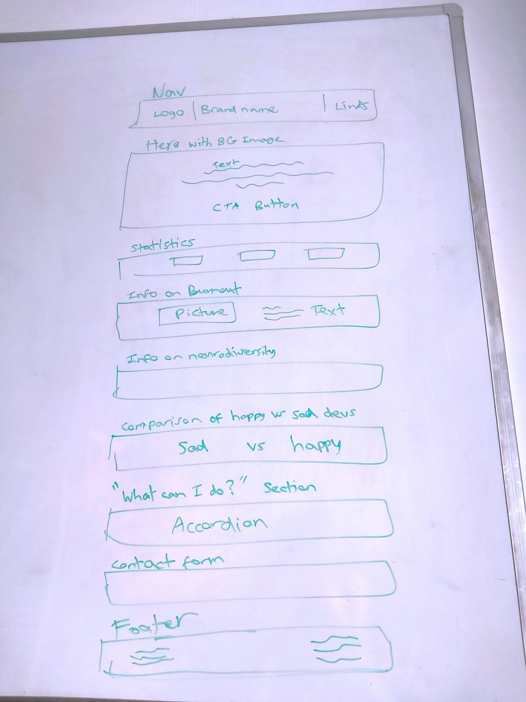
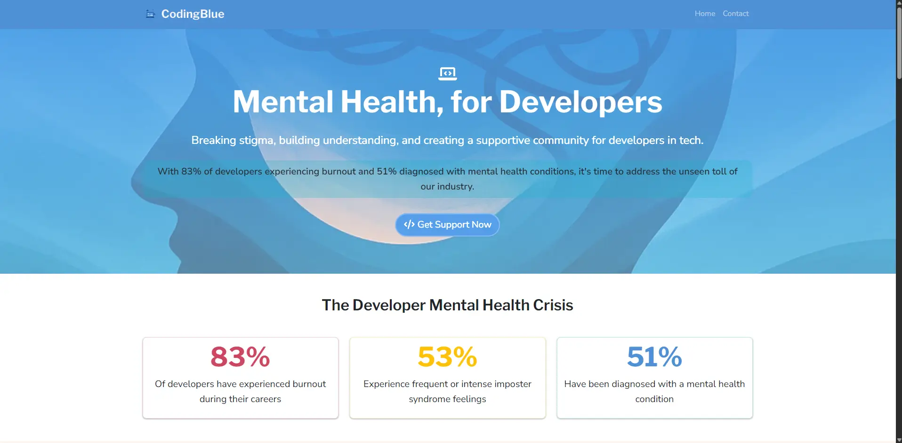
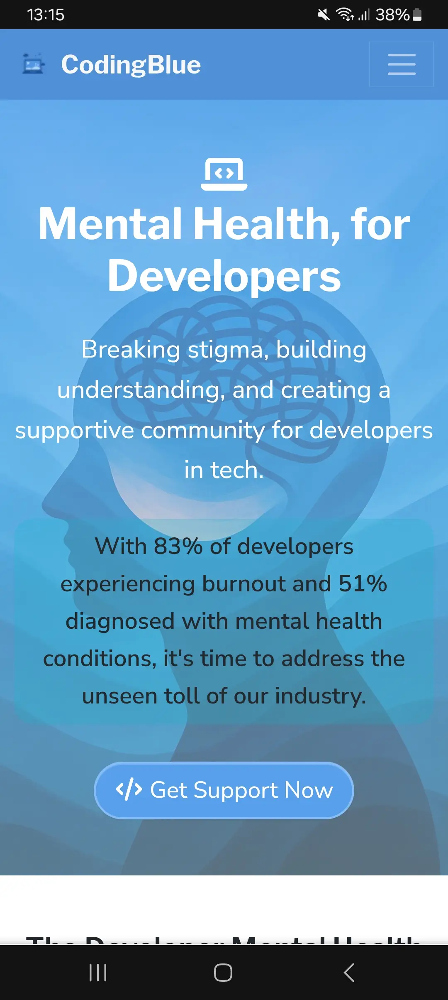
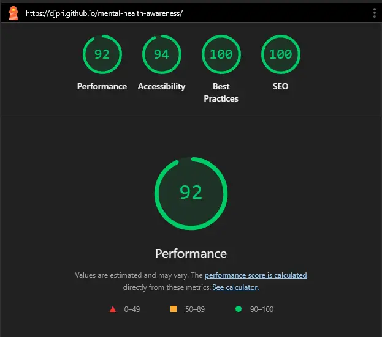

# CodingBlue - Mental Health Awareness for Developers

**A beginner-friendly, accessible website focused on mental health awareness in the software development community.**

**[View Live Site](https://djpri.github.io/mental-health-awareness/)**

---

## About This Project

CodingBlue is a fictitious mental health awareness website specifically designed for software developers and the tech community. The website addresses the unique mental health challenges faced by developers, including burnout, impostor syndrome, and the high-pressure nature of the tech industry.


### Purpose

With **83% of developers experiencing burnout** and **51% diagnosed with mental health conditions**, this project aims to:

- Break the stigma surrounding mental health in tech
- Provide accessible, developer-focused mental health information
- Offer practical coping strategies and resources
- Create a supportive, calming digital environment
- Raise awareness about the mental health crisis in our industry

### Planning / Wireframing

As this was for a simple one page website, wireframing was done using basic sketches and notes on a whiteboard. The planning was mainly focused on the macro level, thinking about the main sections and flow of the site rather than detailed UI elements.



## Features

### Current Features

- **Hero Section**: Powerful opening with developer-focused statistics and call-to-action
- **Statistics Dashboard**: Visual representation of mental health data in the tech industry
- **Burnout Deep Dive**: Comprehensive information about developer burnout and its causes
- **Neurodiversity Awareness**: Highlighting the visibility gap in neurodiversity representation
- **Interactive Comparisons**: Visual contrast between unhealthy and healthy developer lifestyles
- **Practical Guidance**: Accordion-style sections with actionable mental health advice
- **Contact Form**: Safe space for users to reach out for support
- **Resources section**: Immediate access to mental health services
- **Responsive Design**: Optimized for all devices and screen sizes
- **Accessibility**: WCAG 2.1 AA compliant with semantic HTML and proper contrast ratios

---

## Screenshots

### Desktop Experience



### Mobile Experience


---

## Design Choices

### Color Palette

The color scheme was carefully selected using [Coolors.co](https://coolors.co/4f90d6-20c997-f9eae1-ce4760-2d3047) to create a calming yet professional atmosphere:

- **Primary Blue (#4f90d6)**
- **Success Green (#20c997)**:
- **Light Cream (#f9eae1)**:
- **Accent Red (#ce4760)**:
- **Dark Navy (#2d3047)**:

### Typography

Font pairings were carefully chosen using [FontJoy.com](https://fontjoy.com/) to balance readability with emotional warmth:

- **Primary Font**: Nunito Sans - Clean, approachable sans-serif for body text
- **Heading Font**: Libre Franklin - Professional yet friendly for headings
- **Accent Font**: Metrophobic - Modern, tech-appropriate for special elements

### Imagery

All images are AI-generated using various services to ensure:
- Copyright-free usage
- Consistent visual style
- Representation of diverse developers
- WebP format for optimal performance
- Meaningful alt text for accessibility

---

## Technologies Used

### Languages & Frameworks
- **HTML5**: Semantic markup structure
- **CSS3/SCSS**: Custom styling with Sass preprocessing
- **Bootstrap 5**: Responsive framework and components
- **JavaScript**: Form handling and interactive elements

### Tools & Resources
- **Google Fonts**: Typography integration
- **Font Awesome**: Icon library for visual enhancement
- **GitHub Pages**: Hosting and deployment
- **VS Code**: Development environment
- **Git**: Version control
- **AI Tools**: Content generation and code assistance

### Performance Optimizations
- WebP image format for faster loading
- Custom CSS compilation with Sass
- Bootstrap component optimization
- Semantic HTML for better SEO and accessibility

---

## Accessibility Features

This website prioritizes accessibility to ensure mental health resources are available to everyone:

- **Semantic HTML**: Proper heading hierarchy and meaningful element structure
- **WCAG 2.1 AA Compliance**: Meeting international accessibility standards
- **High Contrast**: Carefully tested color combinations for visibility
- **Alt Text**: Descriptive alternative text for all images
- **Keyboard Navigation**: Full site functionality without mouse input
- **Screen Reader Support**: Optimized for assistive technologies
- **Focus Indicators**: Clear visual feedback for interactive elements
- **Responsive Text**: Scalable fonts that remain readable when zoomed

---

## AI Usage & Development Process

AI played a key role in developing this project in the following ways:

- **Content Generation**: Google Gemini's "Deep Research" feature provided comprehensive mental health statistics and information (subject to fact-checking).
- **Image Creation**: AI-generated imagery ensuring consistent style and copyright compliance.
- **Code Generation**: GitHub Copilot assisted with boilerplate code to reduce development time. This code was later reviewed and optimized by myself.
- **Code Review**: GitHub Copilot assisted with code optimization and accessibility improvements.
- **Problem Solving**: AI tools helped debug issues and suggest improvements.

---

## Testing & Validation

### Validation Tools
- **HTML Validator**: W3C Markup Validation Service
- **CSS Validator**: W3C CSS Validation Service
- **Accessibility**: WAVE Web Accessibility Evaluation Tool
- **Performance**: Google Lighthouse auditing
- **Responsive Design**: Chrome DevTools device simulation

### Performance Metrics
- Lighthouse Performance Score: **92**
- Accessibility Score: **94**
- Best Practices Score: **100**
- SEO Score: **100**




---

## Deployment

### GitHub Pages Deployment

This project is deployed using GitHub Pages. To deploy your own version:

1. **Fork or Clone** this repository
2. **Navigate** to your repository settings on GitHub
3. **Select** "Pages" from the left sidebar
4. **Choose** "Deploy from a branch" as the source
5. **Select** the "main" branch and "/ (root)" folder
6. **Save** and wait for deployment (usually 1-2 minutes)
7. **Access** your live site at `https://yourusername.github.io/mental-health-awareness/`

### Local Development

To run this project locally:

```bash
# Clone the repository
git clone https://github.com/djpri/mental-health-awareness.git

# Navigate to project directory
cd mental-health-awareness

# Open index.html in your browser
# Or use a local server like Live Server in VS Code
```
---

## Project Structure

```
mental-health-awareness/
├── index.html                 # Main HTML file
├── README.md                  # This documentation
└── 📦assets/
    ├── 📂images/             # Contains all site images
    └── 📂styles/
        ├── main.css           # Compiled main stylesheet
        ├── main.scss          # Sass source file for custom styles
        ├── custom.scss        # Additional custom styles
        └── main.css.map       # Source map for CSS debugging
```
---

## Content & Research

### Data Sources

The mental health statistics and information presented on this website were compiled using Google Gemini's "Deep Research" feature. While comprehensive research was conducted by the AI, users should note:

- This is a demonstrative project for educational purposes
- All statistics are subject to verification and may not reflect the most current data
- Always consult qualified mental health professionals for personal guidance

---

## Contributing

As this is a demonstrative individual project, contributions are welcome but not required. If you have suggestions for improvement or additional resources, feel free to reach out.
